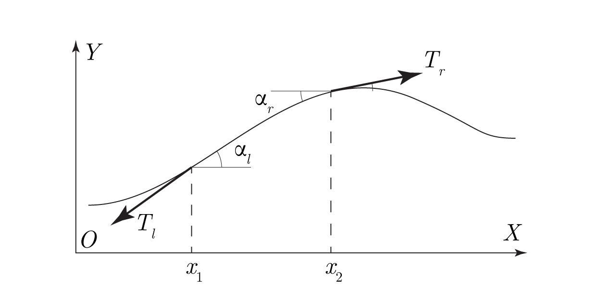

# mechanics_qoc

# Колебания натянутой струны, вынужденные колебания, стоячие волны.

## Уравнение колебаний струны

Рассмотрим малые поперечные колебания струны с натяжением $T$, погонной плотностью $\rho$, около положения равновесия.

Расположим систему координат так, чтобы положение равновесия совпадало с осью $OX$. Пусть колебания струны будут строго поперечными в плоскости $XOY$, тогда обозначим через $U(x, t)$ профиль струны в каждый момент времени.

Рассмотрим участок профиля $(x_1, x_2)$, пусть на него действует результирующая внешних сил $\displaystyle \int_{x_1}^{x_2}dx \cdot f(x, t)$, и сила трения $\displaystyle f_{fr}(x, t) = \int_{x_1}^{x_2}dx \cdot 2 \beta \frac{\partial U(x, t)}{\partial t}$. К концам участка приложены силы натяжения $T_l$ –– слева, $T_r$ –– справа, направленные по касательным к профилю струны. Тогда согласно II Закону Ньютона:

$$ OY: \quad T_{r_y} + T_{l_y} + \int_{x_1}^{x_2}dx \cdot f(x, t) - \int_{x_1}^{x_2}dx \cdot 2 \beta \frac{\partial U(x, t)}{\partial t}  = \int_{x_1}^{x_2}dx \cdot \rho \frac{\partial^2 U(x, t)}{\partial t ^2};$$

$$ OX: \quad T_{r_x} + T_{l_x} = 0, $$

где через $x$ и $y$ обозначены проекции на соответствующие координаты. Эти проекции:

$$ T_{l_y} = - T_l \sin \alpha_l, $$
$$ T_{r_y} = T_r \sin \alpha_r, $$
$$ T_{l_x} = - \sqrt{1-\sin{^2} \alpha_l}, $$
$$ T_{r_x} = \sqrt{1-\sin{^2} \alpha_r}; $$

Пусть струна совершает малые колебания, а ее профиль всюду гладок и не имеет перегибов, тогда все углы $\alpha_l(x)$ и
$\alpha_r(x)$ будем считать малыми при любом $t$. Также будем считать что натяжение струны всюду постоянно и равно $T$. Тогда можно считать:

$$\sin \alpha_l(x) = \sin \alpha_r(x) \approx \tan \alpha(x) \approx \frac{\partial U(x, t)}{\partial x}$$

при $x_2 \to x_1$, а также $\left|T_{r}\right| = \left|\ T_{l}\right| = T$, получим:

$$T_{r_y} + T_{l_y} = \int_{x_1}^{x_2}dx \cdot\lim_{x_2 \to x_1} T \left( \frac{\partial U(x_2, t)}{\partial x} - \frac{\partial U(x_1, t)}{\partial x} \right) = T \int_{x_1}^{x_2}dx \cdot \frac{\partial^2 U(x, t)}{\partial x^2}$$

Подставляя все выражения в уравнение сил по $OY$:

$$\int_{x_1}^{x_2}dx \cdot \left( \rho \frac{\partial^2 U(x, t)}{\partial t^2} +2 \beta \frac{\partial U(x, t)}{\partial t} - T \frac{\partial^2 U(x, t)}{\partial x^2} - f(x, t)\right) = 0$$

отсюда:

$$ \rho \frac{\partial^2 U(x, t)}{\partial t^2} +2 \beta \frac{\partial U(x, t)}{\partial t} - T \frac{\partial^2 U(x, t)}{\partial x^2} = f(x, t) $$

или в случае отсутствия вынуждающих сил и сил трения:

$$ \frac{\partial^2 U(x, t)}{\partial t^2} - \left(\frac{T}{\rho} \right) \frac{\partial^2 U(x, t)}{\partial x^2} = 0 $$

–– обычное волновое уравнение, где скорость распространения возмущения (фазовая скорость) $\displaystyle \upsilon = \sqrt{\frac{T}{\rho}}$.

## Граничные условия решения

Решая два последних уравнения относительно $U(x, t)$, очевидно, что требуется задать 4 граничных условия.

### Краевые

$$U(0, t) = U(l, t) = 0, \quad \text{где} \quad l \text{\ \  -- длина струны,}$$

такие условия всегда накладываются на закрепленную на концах струну.

#### Частота собственных колебаний струны

Не вдаваясь в подробности начального возмущения струны, закрепленной на концах, получим уравнение для частоты свободных колебаний на $m$-й гармонике. 

Решением волнового уравнения свободной струны будет гармоническая функция $U(x, t)$ с круговой частотой $\displaystyle \omega = \sqrt{\frac{T}{\rho}}.$

Зная что в случае стоячей волны, в $l$ должно укладываться целое количество полуволн колебаний, получим собственные частоты:

$$f_{res_m} = \frac{m}{2l} \sqrt{\frac{T}{\rho}}, \quad \text{где} \quad m \in \mathbb{Z}.$$

### Начальные

Получим аналитическое решение для уравнения с учетом трения в случае фиксированной формы вынуждающей силы. Пусть вынуждающая сила задается уравнением:

$$f(x, t) = sin(\omega_f t) \cdot (x-1)x^3 $$

где $(x-1)x^3$ –– амплитудный множитель вынуждающей силы:

Выбор формы профиля вынуждающей силы обусловлен возможностью аналитического решения уравнения с учетом трения и вынуждающей силы.

Зададим дополнительные начальные условия:

$$U(x, 0) = 0, \quad \frac{\partial U(x, 0)}{\partial t} = 0.$$

Аналитическое решение было получено с помощью пакета Wolfram Mathematica:

Здесь заметим, что решение "перемешивает" параметры нашего уравнения, а именно время и координату.

Исходя из этого можно сделать вывод что система обладает гистерезисом, а это значит что получить точное аналитическое решение АЧХ струны невозможно.

Выделим как результат данного решения резонансную частоту в случае гармонической вынуждающей силы:

$$\omega_{res}(m) = \sqrt{\frac{-\beta^2 + \frac{\rho \pi^2 T m^2}{l^2}}{\rho^2}}$$

<!-- $$U(x, t) = \sum_{m = 1}^{\infty} \left[ 12(4 + (-1)^{m} (\pi^2 m^2 - 4)) \left( \cdot
2 \beta l^4 \rho \omega_{f} \omega_{res} \cos (\omega t)\\ -
\right) \right]$$ -->

а также промоделируем АЧХ и колебания струны вблизи резонанса для некоторых начальных параметров:

    l = 1
    T = 10
    rho = 0.01
    beta = 0.01

в файле

    streched_string_demo.py

## Практическая часть

Для наблюдения вышеописанных колебаний, соберем установку:

<!--  -->

Струну закрепим на одном конце, и перекинем через блок на другом конце, и нагрузим свободный конец струны грузом:

Для создания вынужденной силы применим электромагнит, на который подадим переменное напряжение с генератора осциллографа. Разместим этот электромагнит в на расстоянии $\frac{1}{4}l$ от конца струны, таким образом запретим возбуждение 4-й гармоники.

Для того, чтобы магнит создавал силовое воздействие на струну, пропустим по ней постоянный ток от источника, а также установим катушку сенсор на противоположном от магнита конце, вблизи струны как на рисунке ниже:

Подключим катушку сенсор к одному каналу осциллографа, а сигнал с генератора также подадим на другой канал осциллографа.

Цифровой осциллограф предоставляет возможность снятия амплитудно частотных характеристик системы, тогда для разных параметров нагрузки снимем АЧХ, 

